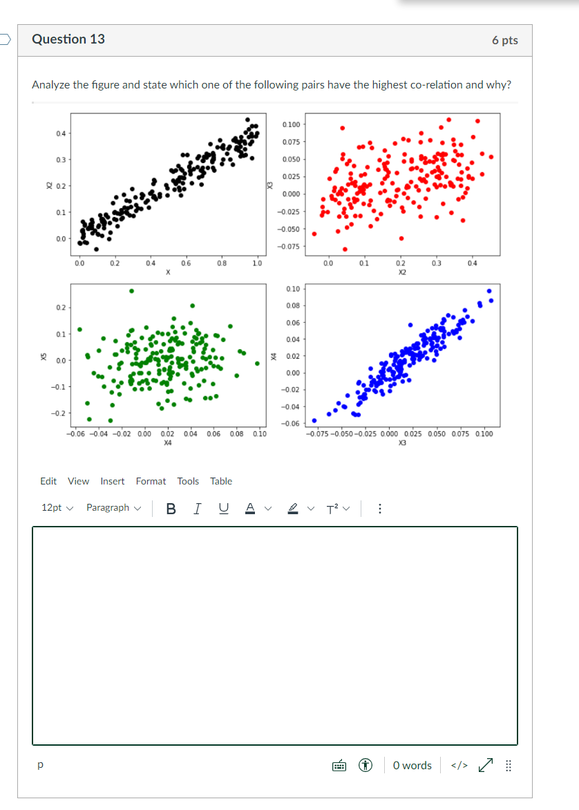

# Midterm: CSC177 Data Analytics and Mining - SECTION 02

- Due Oct 30 at 11:59pm
- Points 100
- Questions 19
- Available Oct 22 at 12am - Nov 24 at 11:59pm
- Time Limit None

## Instructions

Dear students,

Answer all questions.  You are required to work individually on the midterm.
There is no time limit until the due date.

As it is an individual exam, you are (strictly) not allowed to consult with anyone.
Also, if you require any clarification(s) on any question, you must consult
with the instructor and not another student. Any collaboration will be viewed
strictly -- honoring the university honor code is paramount!

You can step in and out of Canvas midterm without hitting the submit button,
since Canvas saves your previous answers. However, once you hit the submit
button, it is final, Canvas will not let you edit your answers.

You have time until the due date.

All questions in this quiz are open book, open notes. You are allowed to search
the internet and consult the python tutorial code.

Enjoy!

Cheers,

:)

Jagan

### Midterm questions

#### Question 01 - 3 pts

Assume an attribute (feature) has a normal distribution in a dataset.
Assume the standard deviation is `S` and the mean is `M`. Typically:

- [ ] Then the outliers usually lie above -3\*M or below +3\*M
- [ ] Then the outliers usually lie below -3\*S or above +3\*S
- [ ] Then the outliers usually lie above -3\*S or below +3\*S
- [ ] Then the outliers usually lie below -3\*M or above +3\*M

#### Question 02 - 3 pts

Which of the following is/are true about PCA?

```txt
A) PCA is an unsupervised method of optimization
B) It searches for the directions that data have the largest variance
C) Maximum number of principle components <= number of features
D) All principal components are orthogonal to each other
```

- [ ] A and C
- [ ] A, B, and D
- [ ] C and D
- [ ] A and B
- [ ] All of the above
- [ ] B and C

#### Question 03 - 3 pts

Discretized values in a decision tree may be combined into a single branch if:

- [ ] order is not preserved
- [ ] data is continuous
- [ ] order is preserved
- [ ] data has wide gaps

#### Question 04 - 3 pts

Linear Regression cannot be applied on every dataset, it is prudent to apply
linear regression if:

- [ ] outliers are removed
- [ ] there are no outliers
- [ ] the correlation is greater than 0.5 or less than -0.5
- [ ] the correlation is less 0.5 or greater than -0.5

#### Question 05 - 3 pts

Dimensionality reduction helps to eliminate irrelevant attributes or reduce
possible noise and ...

- [ ] final attributes are no longer orthogonal to each other
- [ ] produce new attributes that are orthogonal to each other
- [ ] cannot eliminate correlated attributes
- [ ] select the best attributes

#### Question 06 - 3 pts

For non-linear relationships, correlations can give correct results.

- [ ] always, as correlations are independent of linearity
- [ ] sometimes, since non-linearly can reduce to linearity
- [ ] never, as this is not meaningful
- [ ] this is not answerable

#### Question 07 - 3 pts

Overfitting is more likely when you have a huge amount of data to train

- [ ] True
- [ ] False

#### Question 08 - 3 pts

Lasso Regularization can be used for variable selection in Linear Regression

- [ ] True
- [ ] False

#### Question 09 - 4 pts

Which of these statements is true for the Gini index?

```txt
a) Gini Index is represented using Lorenz curve
b) means perfect inequality
c) 1 means perfect equality
```

- [ ] a
- [ ] All of the above
- [ ] a, c
- [ ] c
- [ ] a, b
- [ ] b, c
- [ ] b

#### Question 10 - 3 pts

Which of the following is true about residuals?

```txt
A) Lower is better
B) Higher is better
```

- [ ] Both A and B
- [ ] B
- [ ] None of the above
- [ ] A

#### Question 11 - 4 pts

If the linear regression model is underfitting the data then, which of the
following options would you consider?

```txt
A) Adding more variables
B) Start introducing polynomial degree variables
C) Remove some variables
```

- [ ] A and B
- [ ] A, B, and C
- [ ] B and C
- [ ] A and C

#### Question 12 - 6 pts

Given the observation table for student who pass/do not pass the test according
to their studying style, concentration level and sleeping habits below:

Draw the decision tree for the below table (you can draw it on paper and upload
the picture of the solution).

| Test | Study       | Sleep | Concentrate | Time | Pass? |
| ---- | ----------- | ----- | ----------- | ---- | ----- |
| 1    | Hard        | No    | High        | Long | Yes   |
| 2    | Less        | Yes   | High        | Less | Yes   |
| 3    | Don't Study | No    | No          | Long | No    |
| 4    | Don't Study | No    | High        | Long | No    |
| 5    | Hard        | Yes   | No          | Long | Yes   |
| 6    | Hard        | No    | No          | Less | No    |
| 7    | Less        | Yes   | No          | Long | No    |
| 8    | Less        | Yes   | High        | Long | Yes   |
| 9    | Less        | Yes   | No          | Less | No    |
| 10   | Don't Study | No    | High        | Less | No    |

#### Question 13 - 6 pts

Analyze the figure and state which one of the following pairs have the highest
co-relation and why?



#### Question 14 - 10 pts

Explain your understanding of the equation:

$R^2\:=\:\frac{SSR}{SST}=1\:-\:\frac{SSE}{SST}$

What does $R^2$ (R-squared) describe?

[Statistics By Jim - How To Interpret R-squared in Regression Analysis](https://statisticsbyjim.com/regression/interpret-r-squared-regression/)

In your summary display your intuition by explaining in your own words.
Points will be awarded for originality in explaining the summary in your own
words. Zero points will be awarded if your summary is not in your own words.

>

#### Question 15 - 10 pts

Given the dataset of cars with their mileage and cost for the cost production:

Build a decision tree and attach the picture of your decision tree formed as the
solution to the questioning using hints from tutorial_6.

- What do you think is special about the data type of the values predicted
  in this problem?
- Do a search and find out why a DecisionTreeRegressor is used in this case
  (instead of the general purpose DecisionTreeClassifier)?

Both examples are in the tutorial code.

```python
array(
    [
        ['Toyota Corolla', '40', '20175'],
        ['Ford', '45', '25000'],
        ['Dodge', '62', '35782'],
        ['Chevrolet', '50', '30000'],
        ['Canoo', '57', '34750'],
        ['Tesla', '113', '54000'],
        ['BMW', '70', '36400']
    ],
    dtype='<U21'
)
```

#### Question 16 - 10 pts


From the given dataset find the

- mean
- standard deviation
- 25% - the 25% percentile
- 50% - the 50% percentile
- 75% - the 75% percentile

for the 'Math' and 'English' attribute.

```python
dictionary_data = {
    'Name': ['A', 'B', 'C', 'D', 'E'],
    'Math': [87, 90, 51, 25, 98],
    'English': [50, 68, 45, 88, 14]
}

dataframe = pandas.DataFrame(dictionary_data)
```

#### Question 17 - 10 pts

Explain Lasso and Ridge Regression. Compare and Contrast Lasso and Ridge Regression.

>

#### Question 18

You are given a small dataset with **x** as an independent variable and **y**
as dependent on **x**

**x**: 1, 2, 3, 4, 5

**y**: 3, 4, 2, 4, 5

Find the best fit line for the above.

**Assumption**: Take the mean of the values for features as the initial point

**Hint**: Use the R-squared method.

Note: Show the calculations and answer the equation of the best fit line.

#### Question 19 - 6 pts

You have a dataset of heights and weights of 100 people. The dataset contains
missing values and outliers that need to be removed as a pre-processing step.

The mean height is 170 cm, and the mean weight is 70 kg. However, 10 observation
are missing the value of height, and 5 observation are missing the weight
variable. You want to impute the missing values using the main of the
non-missing observations.

Write a one-line answer for: Why is imputing a value important in this case?

What are imputed values for the missing heights and weights?

>
