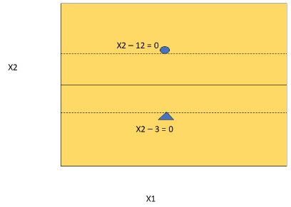
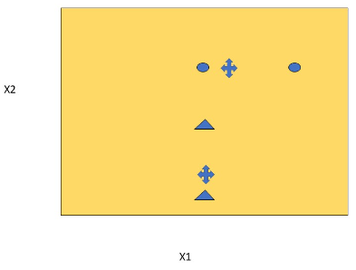

# Quiz 3 - SVM, K-Means, NN

## Question 1: SVM cannot be used when points of both classes are scattered equally in same regions

- [ ] True
- [ ] False

## Question 2: If only a few points are misclassified in SVM around the support vector, then the method uses slack variables

- [ ] True
- [ ] False

## Question 3: Hierarchical clustering uses minimum distance between points in two clusters if the clusters are small and maximum distance between points in two clusters if the clusters are large

- [ ] True
- [ ] False

## Question 4: K-Means Clustering algorithm is guaranteed to stop.

- [ ] True
- [ ] False

## Question 5: K-Means Clustering strictly prohibits starting with initial random centroids too far away from the original clusters

- [ ] True
- [ ] False

## Question 6

The activation function that is used in hidden layers is commonly `\_\_\_` and
the regularization commonly used is `\_\_\_`.

## Question 7

Hierarchical clustering works by starting with a `\_\_\_` matrix and initial
points as clusters and then iteratively merging `\_\_\_`.

## Question 8

Deep neural networks use two basic capabilities. They are `\_\_\_` and `\_\_\_`.

## Question 9

Neural networks combine various intermediate `\_\_\_` to solve non `\_\_\_`
separable problems.

## Question 10

SVM `\_\_\_` method may take very long to execute. However, if the points are
well separated then `\_\_\_` SVM without slack variables will work well.

## Question 11

Please answer the following question:

In the following picture for two dimension points on planes (X1, X2),
the circle and triangle represent support vectors for a dataset of two classes.
Given the equations for the hyperplanes $X2\:-12\:=\:0$ and $X2\:-\:3\:=\:0$
for the circle and triangle, without much calculation find the missing value in
the following equation of the decision boundary drawn in the middle.

The equation is X2 - \_\_\_?\_\_\_ = 0

!

>

## Question 12

For the following Table Calculate the Precision, Recall and F-1 Score
(using the paper on Accuracy, Precision, Recall and F-1 Score in Modules on
Classification) from the matrix:

Precision = `\_\_\_`

F-1 Score = `\_\_\_`

|                     | **Predicted** Positive | **Predicted** Negative |
| ------------------- | ---------------------- | ---------------------- |
| **Actual** Positive | TP = 300               | FN = 200               |
| **Actual** Negative | FP = 700               | TN = 300               |

## Question 13: Explain in which situations F1 Score is desirable over Accuracy

## Question 14

In the following diagram the circles are points (5, 25) and (15, 25).
The triangles are (5, 1) and (5, 11). So the distance between the circle points
is 10 points in the x1 direction and the distance between the triangle points
is 10 points away in the x2 direction. The crosses are two initial centroids.
(9, 25) and (5, 4). Using your intuition, predict the final location of the
centroids when the KNN clustering algorithm stops given that (9, 25) is
relatively closer to the circles than the triangles and (5, 4) is relatively
closer to the triangles than the circles.

The final location of the centroids will be:

For circles: ( `\_\_\_`, 25).

For triangles: (5, `\_\_\_`).

