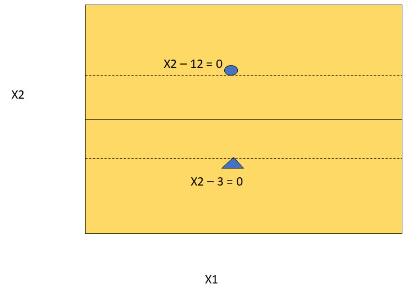
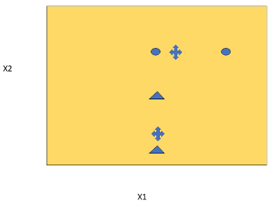

# Quiz 3 - SVM, K-Means, NN

## Question 1: SVM cannot be used when points of both classes are scattered equally in same regions.

- [ ] True
- [x] False

False. Support Vector Machines (SVM) can be used even when points of both classes are scattered equally in the same regions. SVMs are effective in high dimensional spaces and are versatile as different Kernel functions can be specified for the decision function. They are also suitable for cases where the number of dimensions is greater than the number of samples.

## Question 2: If only a few points are misclassified in SVM around the support vector, then the method uses slack variables

- [x] True
- [ ] False

True. In Support Vector Machines (SVM), slack variables are introduced to handle the situation where the data is not perfectly separable. These slack variables allow some of the points to be misclassified, if this leads to a better overall separation of the classes. So, if only a few points are misclassified around the support vector, the SVM method uses slack variables to allow this.

## Question 3: Hierarchical clustering uses minimum distance between points in two clusters if the clusters are small and maximum distance between points in two clusters if the clusters are large

- [ ] True
- [x] False

False. The distance between clusters in hierarchical clustering is determined by the linkage criteria, not the size of the clusters. The linkage criteria could be the minimum distance between points in two clusters (single linkage), the maximum distance (complete linkage), the average distance (average linkage), or other methods. The size of the clusters does not directly influence the linkage criteria.

## Question 4: K-Means Clustering algorithm is guaranteed to stop

- [x] True
- [ ] False

True. The K-Means Clustering algorithm is guaranteed to stop. The algorithm iteratively assigns each data point to one of the K clusters based on the feature similarity (usually Euclidean distance). This process continues until the centroids of the clusters become stable and do not change after a given number of iterations, or the change is below a certain threshold. Therefore, it is guaranteed to stop.

## Question 5: K-Means Clustering strictly prohibits starting with initial random centroids too far away from the original clusters

- [ ] True
- [x] False

 False. K-Means Clustering does not strictly prohibit starting with initial random centroids too far away from the original clusters. The initial centroids in K-Means Clustering are usually chosen randomly and the algorithm does not have a built-in mechanism to ensure that they are close to the final cluster centers. However, starting with centroids too far away from the original clusters may lead to sub-optimal solutions or require more iterations for the algorithm to converge.

## Question 6

The activation function that is used in hidden layers is commonly `used` and
the regularization commonly used is `L2 regularization`.

> The activation function that is used in hidden layers is commonly ReLU (Rectified Linear Unit) and the regularization commonly used is L2 regularization.

## Question 7

Hierarchical clustering works by starting with a `distance` matrix and initial
points as clusters and then iteratively merging `clusters`.

> Hierarchical clustering works by starting with a distance matrix and initial points as clusters and then iteratively merging the closest clusters.

## Question 8

Deep neural networks use two basic capabilities. They are `feature` and `classification`.

> Deep neural networks use two basic capabilities. They are feature learning and classification.

## Question 9

Neural networks combine various intermediate `layers` to solve non `linearly`
separable problems.

> Neural networks combine various intermediate layers to solve non linearly separable problems.

## Question 10

SVM `Sequential Minimal Optimization (SMO)` method may take very long to execute.
However, if the points are well separated then `Hard-Margin` SVM without slack
variables will work well.

> SVM Sequential Minimal Optimization (SMO) method may take very long to execute.
> However, if the points are well separated then Hard-Margin SVM without slack
> variables will work well.

## Question 11

Please answer the following question:

In the following picture for two dimension points on planes (X1, X2),
the circle and triangle represent support vectors for a dataset of two classes.
Given the equations for the hyperplanes $X2\:-12\:=\:0$ and $X2\:-\:3\:=\:0$
for the circle and triangle, without much calculation find the missing value in
the following equation of the decision boundary drawn in the middle.

The equation is X2 - \_\_\_?\_\_\_ = 0

!

> $x_2-\frac{12+3}{2}=0$

## Question 12

For the following Table Calculate the Precision, Recall and F-1 Score
(using the paper on Accuracy, Precision, Recall and F-1 Score in Modules on
Classification) from the matrix:

Precision = `0.3`

F-1 Score = `0.4`

|                     | **Predicted** Positive | **Predicted** Negative |
| ------------------- | ---------------------- | ---------------------- |
| **Actual** Positive | TP = 300               | FN = 200               |
| **Actual** Negative | FP = 700               | TN = 300               |

> Precision = TP \/ (TP + FP)
> Recall = TP / (TP + FN)
> F-1 Score = 2 \* (Precision \* Recall) / (Precision + Recall)
>
> Given the values:
> TP (True Positive) = 300
> FN (False Negative) = 200
> FP (False Positive) = 700
> TN (True Negative) = 300

```python
# We can substitute these values into the formulas:
TP = 300
FP = 700
FN = 200

# Precision
precision = TP / (TP + FP)

# F-1 Score
recall = TP / (TP + FN)
f1_score = 2 * (precision * recall) / (precision + recall)
```

```python
# Now, let's calculate the Precision and F-1 Score:
# Precision
precision = 300 / (300 + 700)  # 0.3

# F-1 Score
recall = 300 / (300 + 200)  # 0.6
f1_score = 2 * (0.3 * 0.6) / (0.3 + 0.6)  # 0.4
```

So, the Precision is 0.3 and the F-1 Score is 0.4.

## Question 13: Explain in which situations F1 Score is desirable over Accuracy

>GitHub Copilot: The F1 Score is desirable over Accuracy in situations where the data is imbalanced. This means that the number of positive samples is much less than the number of negative samples, or vice versa. 

>In such cases, a model might have a high accuracy by simply predicting the majority class, but it would not be effectively identifying the minority class, which is often the point of interest. 

>The F1 Score, being the harmonic mean of Precision and Recall, gives a better measure of the incorrectly classified cases than the Accuracy Metric. It is more useful in the case of uneven class distribution as it seeks a balance between Precision and Recall.

---

> The F1 Score is desirable over Accuracy in situations where there is a significant class imbalance in the dataset. Accuracy might provide a misleading evaluation metric in scenarios where one class vastly outnumbers the other. That is a model could achieve high accuracy by simply predicting the majority class. The F1 Score, which considers both precision and recall. This is valuable in such cases because it provides a balanced measure that considers both false positives and false negatives; and, this is particularly crucial in applications like fraud detection, medical diagnosis, or rare event prediction, for focus is on correctly identifying instances of the minority class while minimizing both types of classification errors.

## Question 14

In the following diagram  the circles are points (5, 25) and (15, 25).
The triangles are (5, 1) and (5, 11). So the distance between the circle points
is 10 points in the x1 direction and the distance between the triangle points
is 10 points away in the x2 direction.  The crosses are two initial centroids.
(9, 25) and (5, 4). Using your intuition, predict the final location of the
centroids when the KNN clustering algorithm stops given that (9, 25) is
relatively closer to the circles than the triangles and (5, 4) is relatively
closer to the triangles than the circles.

The final location of the centroids will be:

For circles: ( `10`, 25).

For triangles: (5, `6`).



> The final location of the centroids will be calculated based on the average of the points in each cluster.
>
> For the circles, the points are (5, 25) and (15, 25). The centroid will be the average of these points, which is ((5+15)/2, (25+25)/2) = (10, 25).
>
> For the triangles, the points are (5, 1) and (5, 11). The centroid will be the average of these points, which is ((5+5)/2, (1+11)/2) = (5, 6).
>
> So, the final location of the centroids when the KNN clustering algorithm stops will be (10, 25) for the circles and (5, 6) for the triangles.
